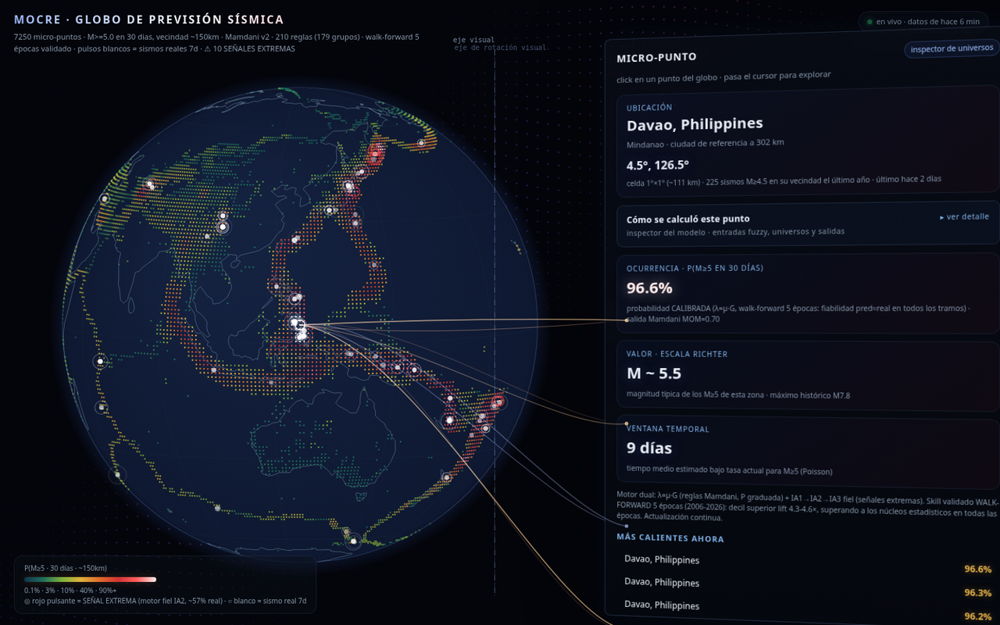
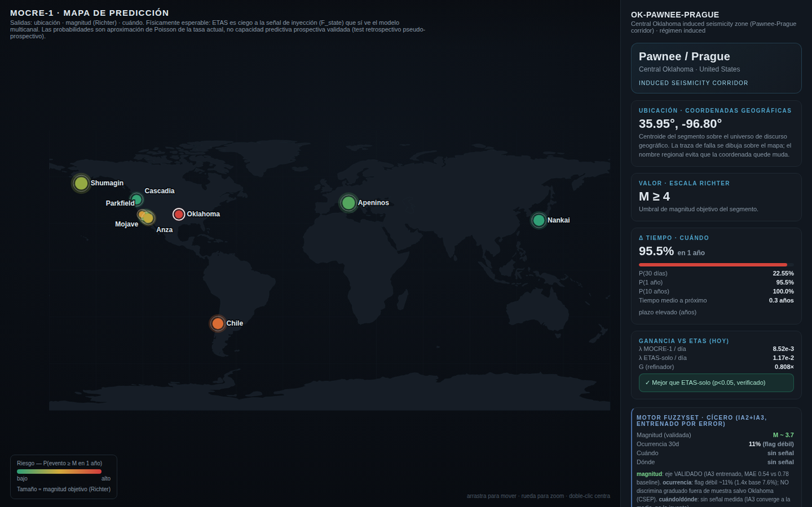
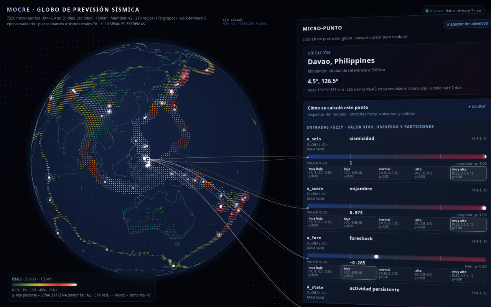

<div align="center">

# MOCRE-1 · Modelo Cavati de Red de Esfuerzo

### An experimental earthquake-forecasting model honest enough to show you where it fails.

[](https://mocre.es)
[](LICENSE)
[](docs/DEVLOG.md)
[](#-disclaimer--read-this)

**[▶ Open the live 3D globe](https://mocre.es/globe/) · [🗺 Segment map](https://mocre.es/map/) · [📓 Full development log](docs/DEVLOG.md)**



</div>

---

## What this is

MOCRE-1 is an auditable research comparison between statistical seismicity baselines and an experimental fuzzy "stress-network" layer. The public global probability currently deploys the **Omori+tasa baseline**: the fuzzy increment did not produce a material walk-forward Brier improvement and remains visible only as a shadow diagnostic.

```
λ_seg(t) = μ_ETAS(t) · G(state, coincidences ; regime)
             │            └─ fuzzy gain over physical + statistical stress signals
             └─ statistical backbone (MLE-fit, frozen, applied causally forward)
```

Each cell reports a target and a probability horizon. The displayed magnitude is explicitly historical climatology, not a predicted magnitude. The displayed Poisson waiting time is `1/λ` derived from `P30`, not a date, interval, or countdown.

## What this is **not**

- **Not** an earthquake *predictor*. It shows how a *relative probability* shifts against a known baseline. It does not tell you an earthquake will happen, where, or when.
- **Not** an alarm system. See the [disclaimer](#-disclaimer--read-this).
- **Not** finished. It is an honest, rigorously-benchmarked research preview — with the emphasis on *honest*.

## Current audited result

The July 2026 audit found and corrected same-day leakage, future interpolation, target/corridor mismatch, holdout calibration, output-centroid errors, protective-rule comparisons, and a non-standard monthly “CSEP” test. With causal features and the official per-event count correction:

| Result | Corrected reading |
|---|---|
| Global occurrence | Omori+tasa deployed; fuzzy Brier delta is only about 10⁻⁶ per fold, below the 10⁻⁴ materiality gate |
| Global magnitude IA3 | MAE 0.331 vs constant baseline 0.319; not published as a prediction |
| Segment magnitude IA3 | MAE 0.388 vs conditioned baseline 0.338; not published |
| Oklahoma | IG −0.805/event; MOCRE expected 219 events and ETAS 183, observed 36; both fail N-test |
| Shumagin | IG +0.305/event, T p=0.054, W p=0.078; absolute N-test fails |
| San Jacinto | only 4 events; W p=0.125, not the former impossible p=0 |

These are exploratory results because the historical holdout was reused while the model evolved. Confirmatory evaluation begins with the immutable prospective ledger in `out/prospective/`.

The formulas, corrected tests, partitions, rules and output metrics are recorded in **[`docs/AUDIT-2026-07-11.md`](docs/AUDIT-2026-07-11.md)**.

The next-generation fuzzy inferencer is implemented in shadow mode: **[`docs/MOCRE2-CRITICAL-STATE.md`](docs/MOCRE2-CRITICAL-STATE.md)**. It infers a recurrent latent critical state from independent physical clusters, validates by earthquake episode and region, and cannot become operational unless every preregistered promotion criterion passes.

## How it works

- **Backbone — ETAS.** Temporal ETAS `(μ, K, c, p, α)` fit by MLE on data before a cutoff, then **frozen and applied causally forward** (no peeking at the holdout).
- **Refiner — fuzzy gain `G`.** A Mamdani/Sugeno fuzzy system (the **IA1→IA2→IA3** architecture of the Cavati lineage) reads normalized "stress-network" states and nudges the baseline up *or down*:
  - **A — activity:** micro-seismicity rate, swarms, foreshock acceleration, Omori decay.
  - **C — load:** recurrence, accumulated stress, and **Coulomb transfer (ΔCFS)** between segments (self-tested point-source graph).
  - **K — deformation:** GNSS interseismic strain and slow-slip transients.
  - **F — fluids:** induced-seismicity injection pressure (the Oklahoma channel).
  - …**15 active channels** of a 25-variable catalog, each mapped onto a shared `[-1,1]` universe with an honest per-variable calibration. Walls (no viable data source) are documented, not faked — see [`INVENTARIO_VARIABLES.md`](INVENTARIO_VARIABLES.md).
- **Evaluation — CSEP comparison.** Per-event log-rate ratios, the official expected-count correction, T/W tests, and an absolute Poisson N-test. Historical results are labeled exploratory.
- **Two layers, clearly separated:** the selected statistical probability and a fuzzy shadow diagnostic. The latter is not an operational alert.

The unvarnished, bug-by-bug story of how every one of these was built (and the several times a promising number turned out to be an artifact we then killed) is in **[`docs/DEVLOG.md`](docs/DEVLOG.md)**.

## See it

| Global 3D globe | Segment map | Model inspector (per cell) |
|---|---|---|
| [](https://mocre.es/globe/) | [](https://mocre.es/map/) | [](https://mocre.es/globe/) |
| 7,250 micro-cells, probability + extreme-signal + real quakes | 9 instrumented fault segments with CSEP verdicts | live fuzzy inputs, universes, partitions and outputs |

## Quickstart

The ~19 GB data tree is **not** committed — it is rebuilt from public sources (USGS ComCat, Nevada Geodetic Lab, and others):

```bash
git clone https://github.com/mattcavati/mocre.git && cd mocre
python3 -m venv .venv && source .venv/bin/activate
python -m pip install -r requirements.txt

cd src
python3 ingest_catalog.py                       # download the seismic catalog
python3 ingest_gnss.py                           # download GNSS series
python3 pipeline.py ../config/segment_sjc.json   # state → ETAS → fuzzy gain → scoreboard + plot
```

Build and preview the static site locally:

```bash
bash deploy/build-public.sh          # assembles public/
python3 -m http.server -d public 8099  # → http://127.0.0.1:8099
```

Run the test suite with the development dependencies:

```bash
python -m pip install -r requirements-dev.txt
python -m pytest -q
```

## Repository layout

```
src/            model + pipeline (ETAS fit, fuzzy engine, ingest_*, CSEP tests, training)
config/         per-segment definitions and real fault traces (JSON)
welcome/        landing page (source)
globe/          global 3D forecast viewer  (self-contained, no CDN)
map/            segment map viewer          (self-contained, no CDN)
deploy/         build + hardened static deploy (allowlist, no interpreter, CSP)
docs/DEVLOG.md  the full, honest development journal
data/  out/     downloaded data and generated outputs  (git-ignored, regenerable)
```

## ⚠️ Disclaimer — read this

**MOCRE-1 is a research preview, not an operational earthquake early-warning system.** It does not predict earthquakes. It estimates how a *relative* probability moves against a statistical baseline, on partial data, with skill that is — honestly — not yet distinguishable from that baseline on most segments. **Do not use it to make any life-safety, evacuation, financial, or engineering decision.** For real hazard information, consult your national seismological agency (e.g. USGS, IGN, INGV).

## Lineage

MOCRE inherits the production fuzzy-logic engine of **[Avaltix](https://avaltix.io)** (IA1→IA2→IA3 architecture, method of Dr. Cícero Romão Cavati) and moves it from market series to seismic stress networks — the transfer is of *method*, not data.

## License · Cite · Contribute

- **License:** [Apache-2.0](LICENSE) (see [`NOTICE`](NOTICE)).
- **Cite:** see [`CITATION.cff`](CITATION.cff).
- **Contribute:** see [`CONTRIBUTING.md`](CONTRIBUTING.md) — the one rule is *report negative results as first-class outcomes*.
- **Security:** please report privately, per [`security.txt`](public/.well-known/security.txt).

<div align="center">

*If a model that tells you when it's wrong is your kind of thing, a ⭐ helps others find it.*

</div>
